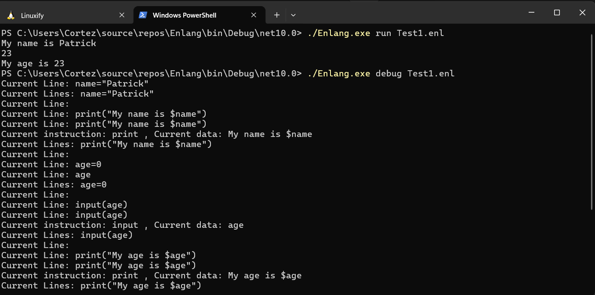
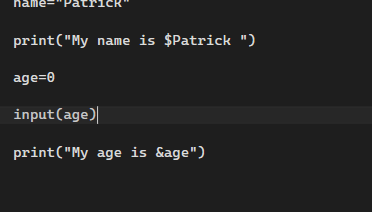

# Enlang

  

**Enlang** is a interpreted programming language with an interactive shell made in C# with the sole aim of education.
This software is not meant to replace industry standard programming languages but rather
its purely for educational attainment on how interpreters work. 

**Enlang** for now has 4 basic instructions output, comments, input and variable declaration:

 - `print("text")` : This outputs "text" to the Console
 - 'input(var)' : This captures the users input and stores it on a variable named *var*
 - `name=value` : This declares a variable.
 - `#Comments` : For documentation

With these basic instructions, you can write simple programs:

```Enlang
# This is a comment

name="Patrick" # This Declares the variable 'name' 

print("Hello my name is: $name "); // prints out what's inside ()

age = 0 # Declares the variable 'age'

print("My age is:")

input(age) #replaces the variable 'age' w/ a new value

print("$age Years old")

```

## Interactive Shell

It also has its own interactive shell with variable expansion for convenience 
with simple linux like commands:

- run : for running .enl normally
- debug : for debugging .enl script
- help : shows commands
- ls : list current directory
- cd : change directory
- clear : clears screen
- edit : Opens a TUI Text Editor
- set : Sets File to use in run and debug
- exit : exits interactive shell.

---

## Status

Loc: 2.5k

The current status of **Enlang** is still work in progress.
I have alot to implement:

Implemented:

- Tokenizer
- Interactive Shell
- Lexer
- Typecaster
- Parser
- Interpreter
- Arithmetic
- Comments
- TUI Text Editor
- Control Flow (if-elif-else) (50%)

Yet to be implemented:
- Functions
- Arrays
- Loops (While and For)

---

## Screenshots






---

## LICENSE

This project is under GNU General Public License V3. Check LICENSE file for more information.